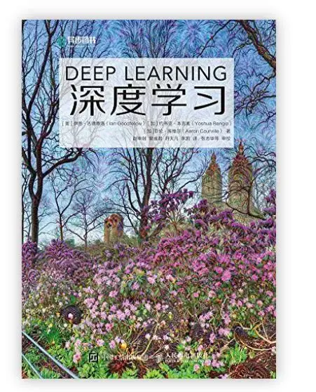
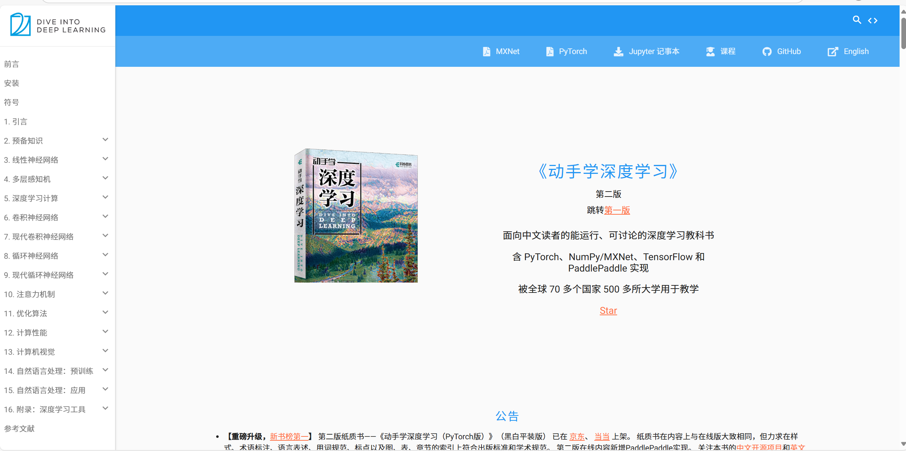

# From MLP to AGI
## By 广西大学人工智能协会

## 项目背景
人工智能的研究可追溯至20世纪50年代，期间历经多次“寒冬”与复苏。最近一次的复苏正是以CNN（卷积神经网络）为代表的深度学习带来的，并造就了今天大家学习工作中离不开的LLM。
深度学习的最新理论与技术日新月异，也许其真的会带领我们实现AI的最高目标——AGI（通用人工智能），但也可能最终深度学习被证明为错误的道路，就如上世纪昙花一现的符号主义那样，并导致人工智能的又一次寒冬。
但那显然已不是本项目考虑的问题，本项目依旧专注于深度学习领域，既了解关键性突破背后深埋的原理与思想，也会用今天的眼光回望并总结其中的经验和教训。
但这总体仍然是面向初学者的书籍，我们会从最简单的MLP出发，一步步深入到如今每个AI从业者都在讨论的LLM，VLA等前沿领域。

## 这是什么？
- 初学者入门深度学习的学习路线指南
- 深度学习代表性技术的复刻教程
- 行业大佬的观点剖析
- 经典论文解读

## 这不是什么
- 事无巨细的教程
- 人工智能发展编年史
- 发表个人观点或工作的平台

## 前置知识
TBD

## 补充资料
### 《DEEP LEARNING》

这本书又称“花书”，被誉为“深度学习的圣经”，可以作为入门指南，本书中缺省的内容大多可以从本书中获取。但是其更偏向理论和数学推导，对于初学者晦涩难懂，也难以指导实践，更适合作为工具书使用。

### 《动手学深度学习 第二版》

若要入门深度学习，笔者更推荐这本书。从名字就可看出，本书既注重理论的讲解与推导，更注重代码实践，因此每个知识点都提供了多种深度学习框架下的代码，且可直接从以下链接获取：
https://zh-v2.d2l.ai/index.html