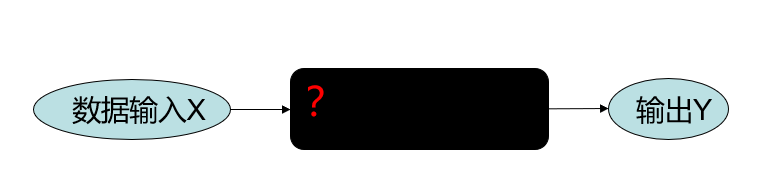
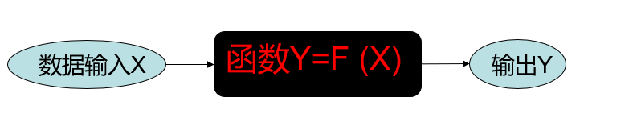
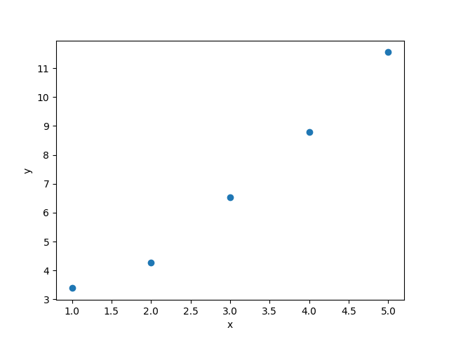

# Chapter0: 深度学习概述
## 名字含义
“Deep Learning”直译为“深度学习”。这里的“深度（Deep）”与“学习（Learning）”分别强调两点：

- 深度（Deep）
  - 指网络的层数足够“深”，通过多层非线性变换形成分层表征：从原始像素/字符到边缘/词法，再到物体/语义/任务目标。
  - “深”强调分层抽象与组合性，而不只是“参数多”或“模型大”。在同等参数量下，适当加深往往更高效（表示能力与计算复用）。
  - 典型实例：从浅层 MLP 到 CNN 的层级卷积特征、再到 Transformer 的多层自注意力堆叠；这一路径正对应本书“从 MLP 走向 LLM/VLA”的主线。

- 学习（Learning）
  - 指以数据驱动、端到端地自动学习特征与决策函数，通过优化算法（如基于梯度的反向传播）从监督/自监督/强化等信号中更新参数。
  - 相较传统“手工特征 + 浅模型”，深度学习将“表示学习（Representation Learning）”与“任务学习”统一在同一可微框架中。

与相关概念的关系
- 机器学习（ML）：深度学习是其子领域，侧重以深层神经网络为假设空间。
- 神经网络（NN）：深度学习主要使用多层神经网络；“深度”强调层级加深带来的表征与计算优势。
- AGI 语境：深度与学习范式促成了可扩展的预训练→微调流程，使 LLM 与多模态 VLA 成为可能，但其是否通向 AGI 仍需审慎评估——本书聚焦方法本身与可复现实践。

## 深度学习的本质
也许你会惊讶，本质的东西难道不应该当学到一定造诣时才能理解吗，为何我会选择在本书开头就阐明？但深度学习的本质就是如此简单，简单到每个高中生都早已接触过其核心思想。
在深度学习未流行的年代，以机器学习为代表的方法往往需要手动构造大量特征。于是先驱们思考能不能发明一种end2end（端到端）的方法，直接从原始数据获得答案（当然，这个认识也历经了很长的发展阶段，这不是历史书，所以我们只是从现在的角度回望过去）。 
模型如下图所示：

在DL领域，我们常把神经网络视为一个黑箱，这是其“深度”带来的原理难以解释性。但现在，我们要考虑到底如何设计这个黑箱，或者说什么东西能描述输入X到Y的映射关系？
没错，答案就是**函数**！正如一位数学教授所言：Functions Describe the World!
我们完全有理由相信不论X与Y的关系如何，总有函数能**拟合**出其关系。
于是我们将上图的模型黑箱替换成了一个函数：

然而，仅笼统地说是函数是不够的，我们学过不同的函数：一次函数、二次函数、三角函数、指数函数、对数函数······不同的函数类型所能描述的映射关系是有限的，显然若Y=$aX^2$，我们将难以用一个一元函数拟合二者之间的关系。好消息是先驱们证明了一种网络结构具备拟合任意多元函数的能力，因此在我们自己设计时不必费心思去考虑函数形式，具体内容会在第二章时具体阐述。
接下来我们会用一个**线性回归**的例子来展示上述模型。
首先我们用Python生成一组近似符合一元一次函数的数据。
 ```python
from matplotlib import pyplot as plt
import numpy as np

X = np.array([1, 2, 3, 4, 5])
Y = np.array([3.38840554, 4.28270371, 6.52134333, 8.79957346, 11.55415885])
plt.scatter(X, Y)
plt.xlabel("x")
plt.ylabel("y")
plt.show()
```
运行结果：

这段程序非常简单，生成了5个仿真的数据并绘制散点图。为了避免程序的随机性我们给定了Y的数值，实际上，Y也是通过以下代码生成的：
```python
def f(x):
    return 2 * x + 1 + np.random.normal(0, 1, x.shape)
Y = f(X)
```
我们的目标是假设一个函数 $\hat{y} = ax+b$，能否拟合出$y=2x+1$，亦即确定a和b的取值。注意这里使用的符号的略微差异，DL常用$\hat{y}$表示预测值，$y$表示真实值。因此也可认为我们的目标是对于任意x，$\hat{y}$要尽量接近$y$。
让我们来看看高中的做法。


